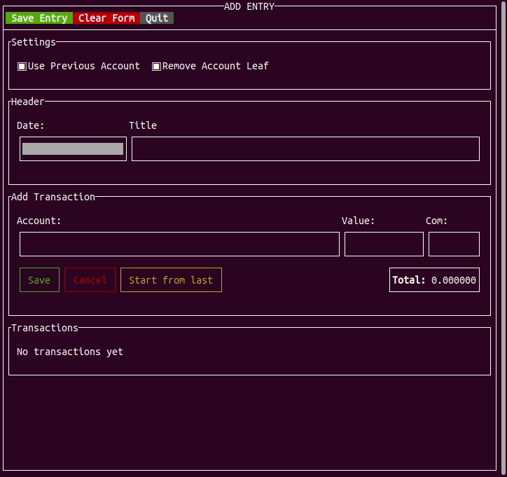

# ltuiny



a simple text-based utility to add a transaction to a [ledger](https://www.ledger-cli.org/) file.

## Is it ready yet?
The project is sill under development but it can already add transactions to a fixed ledger file named `data.dat` on the current directory.

## Dependencies
* cmake >= 3.11
* c++17 compiler
* [FTXUI](https://github.com/ArthurSonzogni/FTXUI) (Downloaded automatically when `cmake ..` is run)

## How to build
```sh
git clone https://github.com/adrianoviana87/ltuiny
cd ltuiny
mkdir build
cd build
cmake ..
cmake --build .
./libs/ltuiapp/ltui_app
```
## Todo
- [ ] Add settings view
- [ ] Add ability to view/edit existing transactions from a ledger file
- [ ] Add support to commit the configured ledger file if it's on a git repo.
